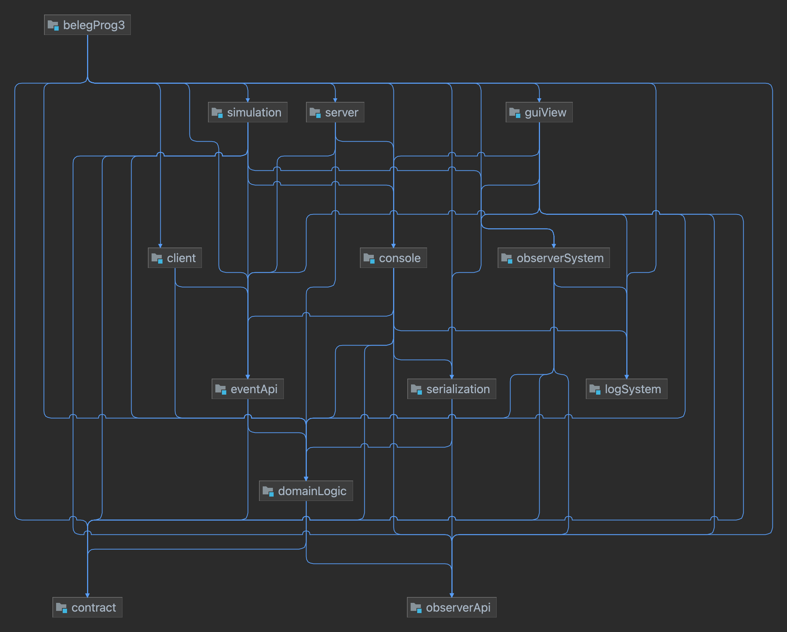

# Beleg PZR1 (93)
Checkboxen befüllen und _kursiv_ gesetzten Text durch entsprechende Angaben ersetzten.
Bei keiner Angabe wird nur Entwurf, Testqualität, Testabdeckung GL, Fehlerfreiheit und Basisfunktionalität bewertet.
Die Zahl in der Klammer sind die jeweiligen Punkte für die Bewertung.
Die empfohlenen Realisierungen zum Bestehen der Prüfung sind **fett** gesetzt.
Ergänzende Anmerkungen bitte immer _kursiv_ setzen. Andere Änderungen sind nicht zulässig.

## Vorrausetzungen für das Bestehen
- [x] Quellen angegeben
- [x] zip Archiv mit dem Projekt im root
- [x] IntelliJ-Projekt (kein Gradle, Maven o.ä.)
- [x] keine weiteren Bibliotheken außer JUnit5, Mockito und JavaFX
- [x] keine Umlaute, Sonderzeichen, etc. in Datei- und Pfadnamen
- [x] mindestens sechs modules (zu jeder Basisfunktionalität außer I/O + belegProg3)
- [x] Trennung zwischen Test- und Produktiv-Code
- [x] kompilierbar
- [x] geforderte main-Methoden nur im default package des module belegProg3

## Entwurf (10)
- [x] **Schichtenaufteilung** (2)
- [x] **Architekturdiagramm** (1)
- [x] Zuständigkeit (2)
- [x] Paketierung (2)
- [x] Benennung (2)
- [x] keine Duplikate (1)

## Tests (28)
- [x] **Testqualität** (7)
- [x] **Testabdeckung GL (inkl. Abhängigkeiten)** (7) _100%_
- [x] **Testabdeckung Rest** (6)
  - [x] Einfügen von Kund*innen über das CLI _CLI, CModus, CustomerEventListener_
  - [x] Anzeigen von Kund*innen über das CLI _CLI, RModus, PrintChoiceListener, PrintCustomersListener_
  - [x] ein Beobachter bzw. dessen alternative Implementierung _HazardsObserver, Storage_
  - [ ] deterministische Funktionalität der Simulationen _getestete Klassen angeben_
  - [x] Speichern via JOS oder JBP _SerializationMethods_
  - [x] Laden via JOS oder JBP _SerializationMethods_
- [x] **mindestens 5 Unittests, die Mockito verwenden** (4)
- [x] mindestens 4 Spy- / Verhaltens-Tests (3)
- [x] keine unbeabsichtigt fehlschlagenden Test (1)

## Fehlerfreiheit (10)
- [x] **Kapselung** (5)
- [x] **keine Ablauffehler** (5)

## Basisfunktionalität (12)
- [x] **CRUD** (2)
- [x] **CLI** (2)
  * Syntax gemäß Anforderungen
- [x] **Simulation** (2)
  * ohne race conditions
- [x] **GUI** (2)
- [x] **I/O** (2)
  * in CLI oder GUI integriert
- [x] **Net** (2)

## Funktionalität (23)
- [x] vollständige GL (2)
- [x] threadsichere GL (1)
- [x] vollständiges CLI (1)
- [x] alternatives CLI (1)
  * _Löschen von Kund*innen, Auflisten der Gefahrenstoffe, storageChangeObserver_
- [x] ausdifferenziertes event-System mit mindestens 3 events (2)
- [x] observer oder property change propagation (2)
- [x] angemessene Aufzählungstypen (2)
- [x] Simulation 2 (1)
- [ ] Simulation 3 (1)
- [x] skalierbare GUI (1)
- [x] vollständige GUI (1)
- [x] data binding verwendet (1)
- [x] Änderung des Lagerplatzes mittels drag&drop (1)
- [x] Einfügen von Frachtstücken via GUI erfolgt nebenläufig (1)
- [ ] sowohl JBP als auch JOS (2)
- [x] sowohl TCP als auch UDP (1)
- [x] Server unterstützt konkurierende Clients für TCP oder UDP (2)

## zusätzliche Anforderungen (10)
- [x] Logeinträge für Nachrichten an die GL (2)
- [x] Logeinträge für Änderungen an der GL (2)
- [x] Trennung zwischen bestehender Implementierung und Log (2)
- [x] geschützter Zugriff auf die Logdatei (1)
- [x] Integration in GUI (1)
- [x] Mehrsprachigkeit (1)
- [x] erweiterbare Mehrsprachigkeit (1)

## Architekturdiagramm

